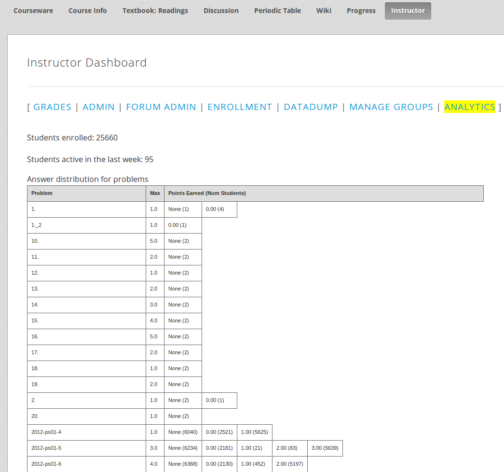
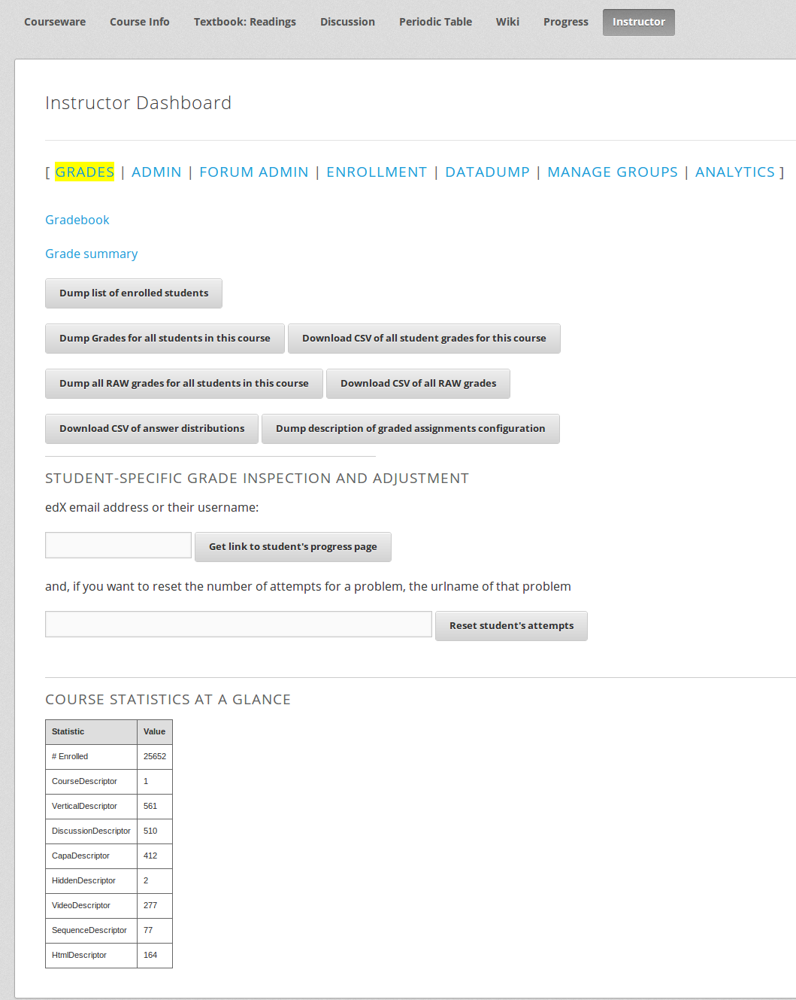
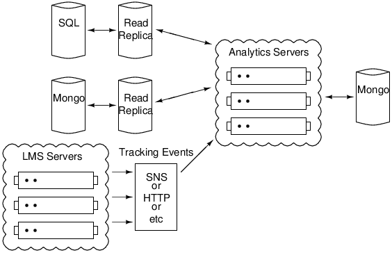

```{r echo=FALSE, warning=FALSE, results='hide', message=FALSE}
wd="/home/vik/mitx_all/vik_sandbox/analytics-slides"
setwd(wd)
library(ggplot2)
```
## Analytics User Needs -- Students

#### Easier
* Statistics on their own performance.
* Breakdowns of how they are performing relative to other students.

#### Harder
* Hints as they attempt problems.
* Interpretable streams of their activity through a course, including time on task.
* Smart grouping via activity in the course.

---
## Analytics User Needs -- Instructors

#### Easier
* Breakdowns of student performance on each section of the course.
* Information on student enrollment rates and locations.

#### Harder
* Alerts when unexpected events occur (ie a large number of students dropping/adding the course)
* Real time monitoring of course statistics and grades.

---
## Analytics User Needs -- Researchers

#### Easier
* Dumps of all existing edX data for a given course.

#### Harder
* Incremental data delivery.
* Versioning to figure out what exact resources students were using at a given time.

---
## Other Potential Users

#### Developers
* Monitor course enrollments around new feature releases.

#### Marketing
* Find students with interesting or unusual activity patterns.

---
## Where is the Data?

#### Mongo
* Course and problem metadata.

#### RDS/SQL
* Student state with respect to courses and problems.

#### Tracking logs
* Student activity as they move through learning sequences.
* Will shortly be streamed into Mongo, but currently log files.

---
## Current State of Analytics -- Data

#### Queries
* Most queries are run manually on the RDS read replica.
* Some queries for instructor dashboard generated by prod-task-001.

#### Data Dumps
* Manual data dumps are sent to researchers.

---
## Current State of Analytics

Instructor Dash |  Instructor Grades
------------- | ------------- 
 | 
---
## Future of Analytics

#### Key Goals
* Define an area for long running-tasks/queries to execute.
* Allow users to define what data they want and access it, instead of manual queries.
* Have easy-to-use instructor dashboards to get relevant data in graphical and csv formats.
* Have access to all relevant edX data in order to expose it to researchers and analytics modules.
* Allow users to authenticate and access only the data that they are allowed to see.
* Don't impact the operation of the production LMS machines.

---
## Future of Analytics

#### djanalytics
* Defines decorators for views, queries, events, and periodic tasks.
* Sets up an API based on the decorators.
* Abstract filesystem and database away from the decorated modules.
* Allow for events to be streamed in.
* Is an installable python package.

---
## Future of Analytics

#### edxanalytics
* Built on top of djanalytics.
* Has edx specific functionality and modules.

---
## edxanalytics Diagram



---
## Questions?